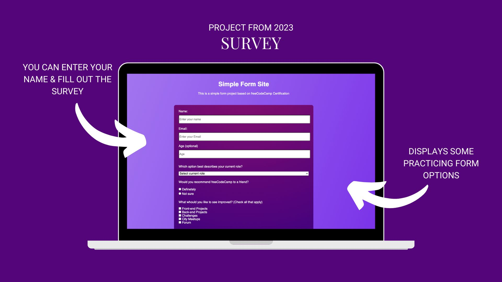

# SURVEY

I've learned with freecodecamp.org & practices my skills to build a form.

## Preview



## Link

Visit the countdown app
[survey](https://cheery-kleicha-6e5951.netlify.app/)

## Code Snippet

```HTML
<div class="form-group">
    <label id="email-label" for="email">Email:</label>
        <input
            type="email"
            id="email"
            name="email-label"
            class="inline"
            placeholder="Enter your Email"
            required
        />
```

## Author

- Vanessa Krämer
  - Aspiring Frontend Developer
  - Developer Akademie Student

## Acknowledgments

- Freedcode Camp
